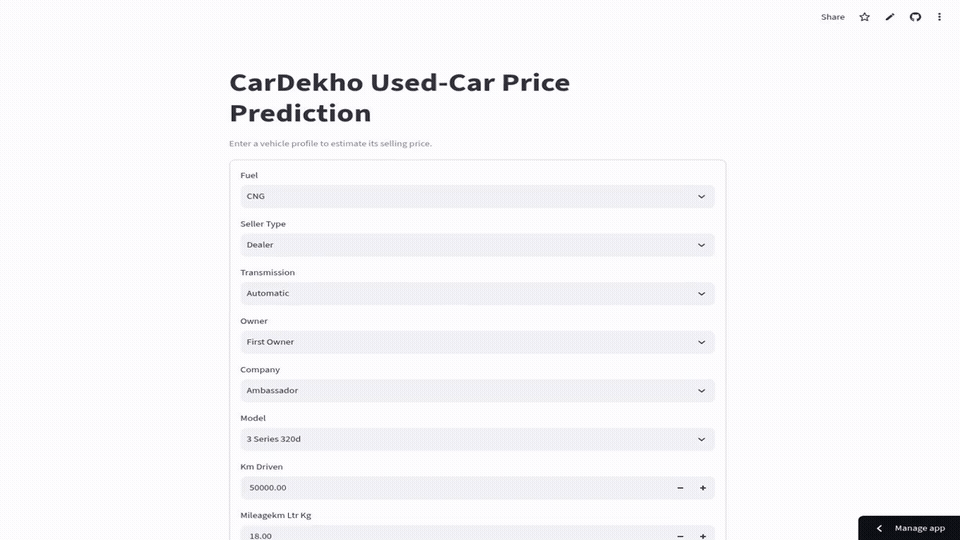

# CarDekho Used-Car Price Prediction

[](https://karim797-cardekho-price.streamlit.app/)

End-to-end regression for estimating used-car selling prices, covering cleaning, feature engineering, leakage-safe preprocessing, cross-validation, model comparison, tuning, diagnostics, and model persistence.



[Download the HD MP4 demo](assets/app-demo.mp4)

## Results

- Selected model: tuned Gradient Boosting
- Target strategy: raw target
- Test R²: **0.9277**
- Test RMSE: **125,946.27**
- Test MAPE: **17.16%**

## Technologies

Python, Pandas, NumPy, scikit-learn, XGBoost, Matplotlib, Seaborn, Joblib, Streamlit, Jupyter.

## Project Structure

```text
.
├── app.py
├── regression_project.ipynb
├── cardekho.csv
├── assets/app-demo.gif
├── assets/app-demo.mp4
├── requirements.txt
├── LICENSE
└── README.md
```

## How to Run

```bash
git clone https://github.com/Karim797/CarDekho-Price-Prediction.git
cd CarDekho-Price-Prediction
python -m venv .venv
source .venv/bin/activate  # Windows: .venv\Scripts\activate
pip install -r requirements.txt
streamlit run app.py
```

Open `regression_project.ipynb` to reproduce the complete experiment.

## License

Released under the [MIT License](LICENSE).
